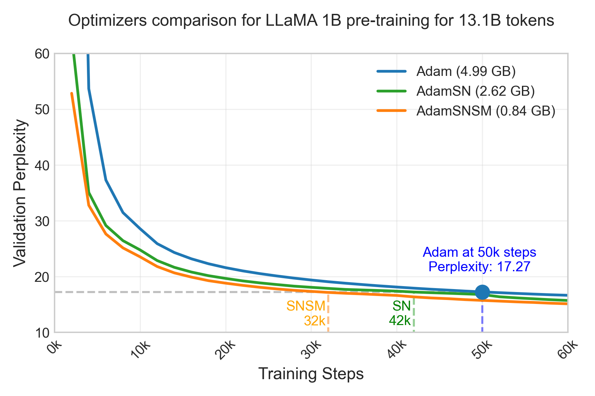
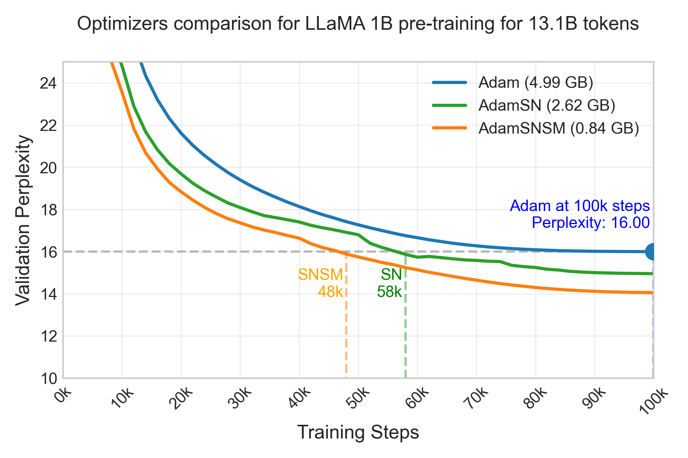
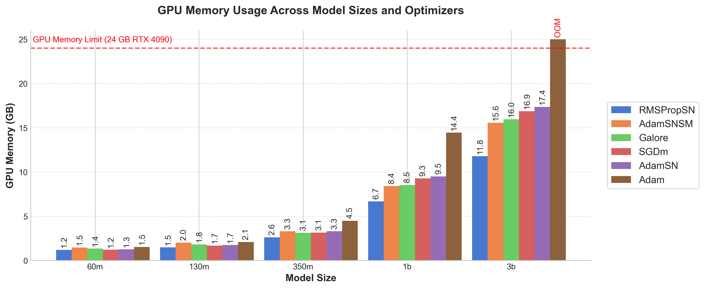
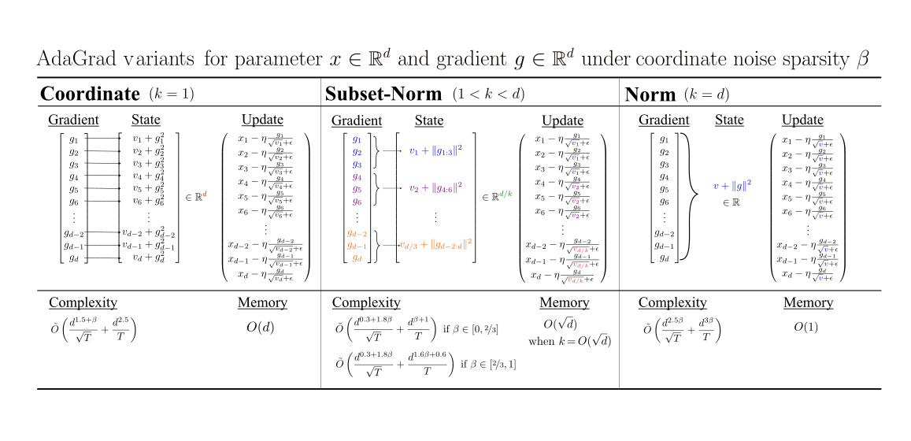

# Subset-Norm and Subspace-Momentum: Faster Memory-Efficient Adaptive Optimization with Convergence Guarantees  

-----
[ICML25 Paper](https://openreview.net/pdf?id=j4HpE61Zcv).

Note: This repo is built on top of [GaLore](https://github.com/jiaweizzhao/GaLore).

<table style="width: 100%; max-width: 1200px; margin: auto;">
  <tr>
    <td style="text-align: center;">
      
    </td>
    <td style="text-align: center;">
      
    </td>
  </tr>
  <tr>
    <td colspan="2" align="center">
      <em>Learning curve for Adam, Adam-Subset-Norm (AdamSN), and Adam-SN with subspace-momentum (AdamSNSM). Parentheses show memory footprint of optimizer.</em>
    </td>
  </tr>
</table>

<figure style="text-align: center;">
  
  <figcaption style="font-style: italic; margin-top: 8px;">
    Figure: Peak memory usage for batch size 1 and activation checkpointing across different optimizers.
  </figcaption>
</figure>


## Quick start
- **Installation**: `pip install -r requirements.txt`
  - Optional: install `fast_hadamard_transform` for approximate SVD and SRHT. 
- **Reproducing results**: The file `examples.sh` for example commands to run various optimizers described in the paper.
- **Configuring optimizer**: See `get_optimizer.py` for configuring optimizer.
An example of using AdamSNSM for linear modules is shown below:
```python
# Compress linear modules only which make up the vast majority of transformer's parameters
linear_modules = [module.weight for module in model.modules() if isinstance(module, nn.Linear)]
regular_params = [p for p in model.parameters() if id(p) not in [id(p) for p in linear_modules]]
# Configure Param Groups
param_groups = [
   # regular Adam or AdaGrad on non-linear modules
   {'params': regular_params},  
   # SN and SM params
   {'params': linear_modules, 
    # subset-norm config  (remove to not use SN)
    'subset_size': 'heuristics',  
    # subspace-momentum config  (remove to not use SM)
    'rank': args.rank, 'proj_type': args.proj_type, 'update_proj_gap': args.update_proj_gap, 
    }
]
optimizer = GenericOptim(  # set momentum_type and second_moment_type
   param_groups, lr=args.lr, weight_decay=args.weight_decay, 
   momentum_type="sm", second_moment_type="sn" 
)
```
- **Usage**: Just call `step()` similarly to most standard optimizers.
```python
# Forward pass
outputs = model(inputs)
loss = loss_fn(outputs, targets)
# Backward pass and step
optimizer.zero_grad()
loss.backward()
optimizer.step()
```

### Main files description
- `GenericOptim.py` contains the general optimizer definition that works for both subset norm and subspace momentum.
- The specific implementation for SN is in `subset_norm.py` and for SM is in `subspace_momentum.py`.
- The `projectors` directory contains different projectors for subspace-momentum.
- `adamw_sn.py` and `adamw_sng.py`  files contain example standalone implementation for SN step sizes (more details below).

-----
# Subset-Norm step size

This section describes Subset-Norm in more details.

<div style="text-align: center; max-width: 100%; margin: auto;">
  
  <figcaption><em>Figure: Summary of the algorithm and theoretical results for the Subset-Norm step size.</em></figcaption>
</div>

## Adamw_SNG usage
This is the main AdamwSN General version where the user can specify the subset size. There are two ways you can use the optimizer:
(1) restrict the subset-norm step size to nn.Linear modules only or (2) perform the subset-norm step size on all parameters.
See the 2 sections below for usage in each case. 

In the paper, the best results are obtained when the SN step size is restricted to nn.Linear modules only: better convergence than Adam while using significantly less memory.
However, this restriction could be tough on distributed setup like FSDP, so we can perform subset-norm on all parameters which is a lot simpler. 
For the second case, the performance is about the same as Adam (but worse than case 1) in our experiments.

Finally, the learning rate for these optimizers with the recommended subset size is typically 10 times larger than you would set for Adam (coordinate-wise).
So for example, if you typically train AdamW with lr of 1e-4 then you could try AdamwSN with a lr of 1e-3 to start the hyperparameter search.  

### (1) Recommend: Perform SN compression on nn.Linear modules only
For transformers, compression seems the most effective when applied to nn.Linear modules only, which makes up the vast majority of the parameters of transformers.
One can use the AdamwSNG optimizer for linear modules only as follows: 
```python
from adamw_sng import AdamwSN

# suppose we parse args for `lr`, `weight_decay`, and `subset_size`
# suppose we have defined a `model` of type torch.nn.Module

sn_params = [module.weight for module in model.modules() if isinstance(module, nn.Linear)]
id_rownorm_params = [id(p) for p in sn_params]
regular_params = [p for p in model.parameters() if id(p) not in id_rownorm_params]
param_groups = [{'params': regular_params, 'sn': False},
                {'params': sn_params, 'sn': True}]
optimizer = AdamwSN(param_groups, lr=args.lr, weight_decay=args.weight_decay,
                    betas=(0.9, 0.999), subset_size=args.subset_size)
```

### (2) Generic case: subset size for arbitrary parameter or FSDP flattened concatenated
When your model contains other parameters or when partitioning the parameters into param_groups is not possible or efficient (such as in FSDP training), 
one can use the optimizer as a standard PyTorch optimizer:
```python
from adamw_sng import AdamwSN

# suppose we parse args for `lr`, `weight_decay`, and `subset_size`
# suppose we have defined a `model` of type torch.nn.Module
optimizer = AdamwSN(model.parameters(), lr=args.lr, weight_decay=args.weight_decay,
                    betas=(0.9, 0.999), subset_size=args.subset_size)
```

This seems to perform slightly worse than the Linear modules only version above (still similarly to vanilla Adam however).
However, with the speed gain in training, we can train for slightly longer to attain the same result. 

### Recommended subset size
If you do not know what subset_size to set, a good rule of thumb is to set it as $$d/2$$ where $$d$$ is the hidden dimension of your transformer model.
For example, the hidden dimension is 4096 for Llama 7B and so a good subset_size could be 2048. 

You can leave the `subset_size` argument to its default value of -1 to use the recommended subset size as stated above. 

## Adamw_SN simple partition scheme from paper usage
This version of AdamwSN requires no additional hyperparameter on top of Adam.  

**Importing the Optimizer**

Currently, we have only tested AdamSN on 2D Linear modules 
```python
from adamw_sn import AdamwSN

sn_params = [module.weight for module in model.modules() if isinstance(module, nn.Linear)]
id_rownorm_params = [id(p) for p in sn_params]
regular_params = [p for p in model.parameters() if id(p) not in id_rownorm_params]
param_groups = [{'params': regular_params}, {'params': sn_params, 'sn': True}]  # enable subset-norm
                
# Note that one can set beta1 = 0 to use RMSProp to save even more memory
optimizer = AdamwSN(param_groups, lr=0.001, betas=(beta1, beta2))
```

### Implementation 
AdamwSN is a simple modification of AdamW:
```diff
for p in group["params"]:
    grad = p.grad
    state = self.state[p]
    if "step" not in state:
        state["step"] = 0
    beta1, beta2 = group["betas"]

+   # Subset Norm
+   if "reduce_dim" not in state and len(grad.shape) == 2:
+       state["reduce_dim"] = 0 if grad.shape[0] >= grad.shape[1] else 1
+   if len(grad.shape) == 2:
+       second_moment_update = torch.sum(grad**2, dim=(1 - state["reduce_dim"]), keepdim=True)
+   else:
+       second_moment_update = grad**2

    # State initialization
    if "exp_avg" not in state:
        state["exp_avg"] = torch.zeros_like(p)
-       state["exp_avg_sq"] = torch.zeros_like(p)
+       state["exp_avg_sq"] = torch.zeros_like(second_moment_update)  # smaller size

    exp_avg, exp_avg_sq = state["exp_avg"], state["exp_avg_sq"]

    state["step"] += 1

    exp_avg.mul_(beta1).add_(grad, alpha=(1.0 - beta1))
-   exp_avg_sq.mul_(beta2).addcmul_(grad, grad, value=1.0 - beta2)
+   exp_avg_sq.mul_(beta2).add_(second_moment_update, alpha=1.0 - beta2)

    denom = exp_avg_sq.sqrt().add_(group["eps"])

    norm_grad = exp_avg / denom  # broadcast division


    step_size = group["lr"]
    if group["correct_bias"]:  # No bias correction for Bert
        bias_correction1 = 1.0 - beta1 ** state["step"]
        bias_correction2 = 1.0 - beta2 ** state["step"]
        step_size = step_size * math.sqrt(bias_correction2) / bias_correction1

    p.add_(norm_grad, alpha=-step_size)
```

----

# Subspace-Momentum
Under construction...
